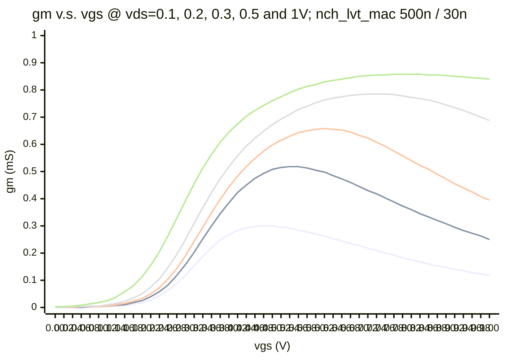

#### FEOL: MOSFET

- NMOS, 1 finger, finger width 500nm, L 30nm
  - Ron = 600Ω (575Ω FEOL + 25Ω BEOL)

| NMOS type                  | region                        | cgg    | css      | cdd      |
| -------------------------- | ----------------------------- | ------ | -------- | -------- |
| lvt_mac                    | pinch off (VG=VD=1, VS=VB=0)  | 0.32fF | 0.27fF   | 0.09fF   |
| rf_lvt_nw                  | pinch off                     | 0.37fF | ?0.21fF? | ?0.08fF? |
| lvt_mac                    | triode (VG=1, VD=VS=VB=0)     | 0.42fF | 0.27fF   | 0.23fF   |
| rf_lvt_nw                  | triode                        | 0.44fF | ?0.18fF? | ?0.19fF? |
| lvt_mac / rf_lvt_nw (why?) | turn off (VD=1/0, VG=VS=VB=0) | 0.19fF | 0.09fF   | 0.08fF   |

#### BEOL: Metal and Via (including contact)

| Metal type        | Code | Material | Dielectric  | W/S (µm) (before 0.9 shrink) | Thickness (µm)          | Sheet Resistance @ min W/S | Mask layers                                                 | DC Imax (mA) @ 110℃      |
| :---------------- | :--- | -------- | ----------- | :--------------------------- | :---------------------- | -------------------------- | :---------------------------------------------------------- | ------------------------ |
| OD                |      |          |             |                              | 0.092? (from EMX .proc) | 22.5                       |                                                             |                          |
| PO                |      | Poly     |             |                              | 0.043? (from EMX .proc) | 50.68                      |                                                             |                          |
| M1                | M1   | Cu       | ELK         | 0.05/0.05                    | 0.09                    | 0.45                       | M1 (360) only                                               | 0.996 × (0.9w - 0.003)   |
| 1X Metal          | Mx   | Cu       | ELK         | 0.05/0.05                    | 0.09                    | **0.45**                   | M2~M8 (380, 381, 384, 385, 386, 387,388), max: seven layers | 0.996 × (0.9w - 0.003)   |
| 2X Metal          | My   | Cu       | LK          | 0.1/0.1                      | 0.19                    |                            | M5~M9 (385, 386, 387, 388, 389), max: two layers            | 2.208 × (0.9w - 0.016)   |
| 8X Metal          | Mz   | Cu       | USG         | 0.4/0.4                      | 0.85                    | **0.0218**                 | M5~M10 (385, 386, 387, 388, 389, 38A), max: three layers    | 9.048 × (0.9w - 0.02)    |
| 10X Metal         | Mr   | Cu       | USG         | 0.5/0.5                      | 1.15                    |                            | M5~M10 (385, 386, 387, 388, 389, 38A), max: two layers      | 12.631 × (0.9w - 0.02)   |
| Ultra Thick Metal | Mu   | Cu       | USG         | 2.0/1.0                      | 3.5                     | **0.0051**                 | M5~M9 (385, 386, 387, 388, 389), max: one layer             | 34.590 × (0.9w - 0.02)   |
| AL RDL            | AP   | Cu       | Passivation | 2.0/2.0                      | 2.8 (FC/WB); 1.45 (WB)  | **0.011** / ?               | AP (309)                                                    | 5.79 × 0.9w; 3.00 × 0.9w |

---

| Via type        | Code | Material | W/S (µm) (before 0.9 shrink)                                 | Resistance  | DC Imax (mA) @ 110℃ |
| :-------------- | :--- | -------- | :----------------------------------------------------------- | ----------- | ------------------- |
| PO-M1           |      | ?        | 0.04                                                         | 100         |                     |
| OD-M1           |      | W-Plug   | 0.04                                                         | 90          |                     |
| 1X Via          | Vx   | Cu       | 0.05/0.07 (square-square);  0.05/0.075 (square-rectangular);  0.05/0.08 (rectangular-rectangular) | 8 / 4.5     |                     |
| 2X Via          | Vy   | Cu       | 0.1/0.1                                                      |             |                     |
| 8X Via          | Vz   | Cu       | 0.36/0.34                                                    | 0.27        |                     |
| 10X Via         | Vr   | Cu       | 0.46/0.44                                                    |             |                     |
| Ultra Thick Via | Vu   | Cu       | 0.36/0.34                                                    | 0.35        |                     |
| AL Via          | RV   | ?        | 3.0/2.0 or 2.0/2.0                                           | 0.04 / 0.06 |                     |

ref: TN28CLDR002.pdf; https://blog.csdn.net/qq_45362336/article/details/157441168

> Figure 2.4.1 Cross-section for 1P10M_5x2y2z         Figure 2.4.2 Cross-section for 1P10M_5x2y2r
>
> Table 2.5.1 Naming for Different Metal Thicknesses
> 
> 4.5.65.2.1 Metallization Options       Naming for different metal types
>
> 10.4.4 Cu Wire Current Density (EM) Specifications (Tj =110°C)      Table 10.4.2

Two typical metal configuration options: 1. full-metal `1P10M_5x2y2z`, and 2. the common MPW tape-out option `1P9M_6X1Z1U`

| Metal | 1P10M_5x2y2z | 1P9M_6X1Z1U |
| :---- | :----------: | :---------: |
| M1    |      M1      |     M1      |
| VIA1  |     Vx1      |     Vx1     |
| M2    |     Mx1      |     Mx1     |
| VIA2  |     Vx2      |     Vx2     |
| M3    |     Mx2      |     Mx2     |
| VIA3  |     Vx3      |     Vx3     |
| M4    |     Mx3      |     Mx3     |
| VIA4  |     Vx4      |     Vx4     |
| M5    |     Mx4      |     Mx4     |
| VIA5  |     Vx5      |     Vx5     |
| M6    |     Mx5      |     Mx5     |
| VIA6  |     Vy1      |     Vx6     |
| M7    |     My1      |     Mx6     |
| VIA7  |     Vy2      |     Vz1     |
| M8    |     My2      |     Mz1     |
| VIA8  |     Vz1      |     Vu1     |
| M9    |     Mz1      |     Mu1     |
| VIA9  |     Vz2      |             |
| M10   |     Mz2      |             |
| RV    |      RV      |     RV      |
| AP    |      AP      |     AP      |

#### Intrinsic Delay

- pdk
  - CRN28HPC+
- simulator
  - Spectre X
  - Accuracy: AX
- MOSFET size
  - p: 260nm / 30nm, 1 finger
  - n: 200nm / 30nm, 1 finger
- inverter type
  - 1: `inv_lvt_mac` 
  - 2: `INVD0BWP12T30P140LVT`
  - 3: `nch_lvt_mac` + `pch_lvt_mac`

| Pre-sim intrinsic delay (1 / 2 / 3) ps | TT40 | SS75            |
| -------------------------------------- | ---- | --------------- |
| 0.9                                    |      | 3.9 / 3.2 / 3.2 |
| 1.0                                    |      |                 |
| 1.1                                    |      |                 |

| Post-sim intrinsic delay (cell routing only) (1 / 2 / 3) ps | TT40         | SS75         |
| ----------------------------------------------------------- | ------------ | ------------ |
| 0.9                                                         | ? / 4.43 / ? | ? / 5.25 / ? |
| 1.0                                                         | ? / 3.95 / ? | ? / 4.5 / ?  |
| 1.1                                                         | ? / 3.62 / ? | ? / 4 / ?    |

| Post-sim intrinsic delay (ring osc routing) (1 / 2 / 3) ps | TT40 | SS75 |
| ---------------------------------------------------------- | ---- | ---- |
|                                                            |      |      |
|                                                            |      |      |
|                                                            |      |      |
